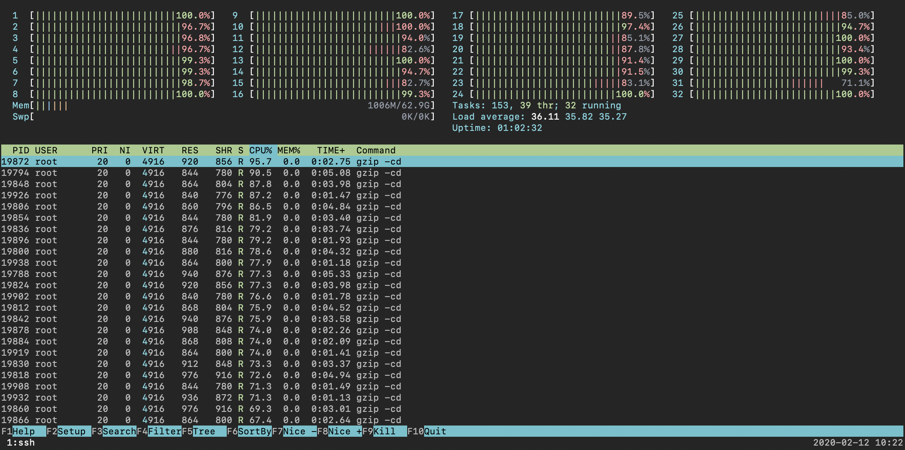
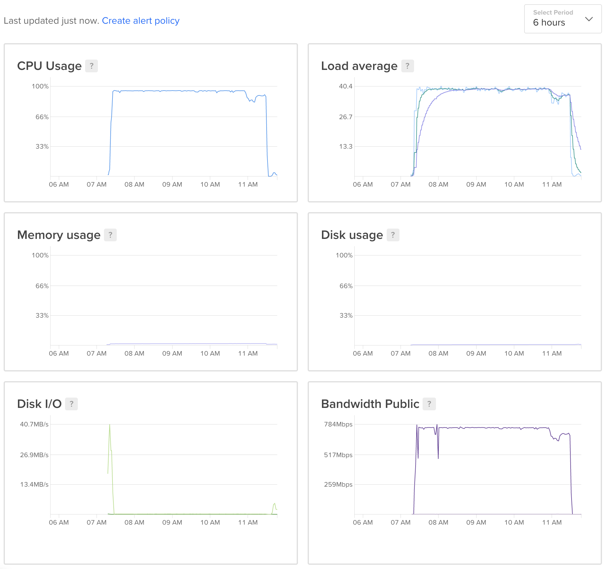

## Introduction

It's been over three years since I've last posted to this blog. Today I am
happy to announce, after nearly a year of work, the release of
[instant.bible][web], a Bible search engine that delivers results from multiple
translations of the Bible instantly, as you type. You can try it out now by
heading over to [instant.bible][web], or you can find the app on the [Apple App
Store][apple] as well as on [Google Play][googleplay].

## Technical Overview

The search engine is written in Rust, and each of the clients are written in
the native languages for their respective platforms (TypeScript with Rust
compiled to WASM for the web, Swift with Rust compiled to a dynamic library
used via FFI for iOS, and Kotlin with Rust compiled to a JNI library for
Android).

The source code is available on Github at [knpwrs/instant.bible][repo].

This is the first time I've written a search engine. Likewise, this is the
first time I've written anything substantial in Rust, Kotlin, or Swift. It goes
without saying I learned a lot while working on this project.

## Search and Indexing

For my original attempts to write a reverse index I was using Rust's built-in
BTreeMap and HashMap data structures. I had also attempted to organize my
index keys as a prefix trie in order to support prefix lookups. This wound up
using multiple gigabytes of memory, which is far more than I really wanted to
use for a search index, especially for a fixed search space of nothing but
Bible verses. After looking for solutions I wound up creating maps using Andrew
Gallant's excellent [FST library][fst]. Briefly:

> This crate provides a fast implementation of ordered sets and maps using
> finite state machines. In particular, it makes use of finite state
> transducers to map keys to values as the machine is executed. Using finite
> state machines as data structures enables us to store keys in a compact
> format that is also easily searchable. For example, this crate leverages
> memory maps to make range queries very fast.

Using FST instead of Rust's built-in data structures reduced ram usage from
multiple gigabytes to under 200 megabytes. Using FST additionally enabled me to
not only lookup keys by prefix, but also gave me typo tolerance by being able
to search for keys within a given Levenshtein distance. I highly recommend
reading Andrew Gallant's blog post, Index [1,600,000,000 Keys with Automata and
Rust][agblog], for more details on how the
FST crate works. I can't say enough about how awesome this crate is.

## Textual Relevance

For a long time, I tried to rank verses purely by textual relevance to search
queries; however, this did not return quality results. I was searching for
specific verses and they weren't ranked how I was expecting them to be ranked.
It occurred to me that most people would be searching for verses they had heard
before or were otherwise memorable, and I could approximate this by
additionally ranking verses by their relative popularity.

## Determining the Most Popular Bible Verses

In order to get a rough approximation of how popular any given Bible verse was
I decided that I should compile a ranked list of how many times each verse in
the Bible is referenced across the Internet. My original idea was going to be
to use the [Bing Web Search API from Azure][bing] to execute a search for each
verse in the Bible (Genesis 1:1, Genesis 1:2, etc) and collect the number of
estimated results for each search. The idea is that the number of times each
verse is referenced across the Internet (i.e., how often people quote that
verse) could be used as a rough estimate of how likely people are to be
searching for that verse. As of this writing, the API costs $7 per thousand
searches — so at ~31,102 verses in the Bible this would come to cost ~$224;
however, as I looked into the [terms and conditions][bingterms] I saw the
following:

> Do not:
>
> - Copy, store, or cache any data from responses (except retention to the
>   extent permitted by continuity of service.
> - Use data received from the Search APIs as part of any machine learning or
>   similar algorithmic activity. Do not use this data to train, evaluate, or
>   improve new or existing services that you or third parties might offer.

Well, it sounds like my exact use case for the API is not allowable. Fair
enough. I needed a different way to determine the ranking of Bible verses.

## Common Crawl

[Common Crawl][cc] is an organization that crawls the Internet and makes the
data available to anyone to use. The data is hosted free of charge for anyone
to access on AWS S3 as a part of the [AWS Public Dataset Program][awspdsp].
Common Crawl provides a monthly digest of web crawl data available in WARC
(everything), WAT (metadata), and WET (text) formats. For my purposes, I just
needed to count verse references in WET files. I decided to run against the
[January 2020 Common Crawl][cc202005], which contains 56,000 gzip-compressed
WET files totaling about 10TiB in size. That's a lot of text to scan!

My initial attempt to scan the text was a program written in Rust.
Unfortunately, my program was not very efficient and when I started to run it
on a compute-optimized [DigitalOcean][do] instance (I used an instance with 32
dedicated hyperthreads and 64GB of memory, which as of this writing costs
$0.952 per hour) it became apparent to me that at best my program would finish
in about 40 hours. Now, a cost of about $38 isn't bad, especially considering
the previous estimate of $224 for using an API, but 40 hours was too long to be
able to try things quickly and fix any problems that arise.

That's when I remembered [Andrew Gallant][ag]'s post, _[Index 1,600,000,000
Keys with Automata and Rust][agblog]_. In it, he used a simple bash script
utilizing curl, zcat, xargs, and grep to process Common Crawl data. I decided
to try that approach for my project. Some 19 lines of Bash scripting later
(which is mostly ceremony, it could be shorter if I didn't care about
readability) I had a system in place that could scan CommonCrawl WET files
streaming out of curl and zcat for 66 regular expressions, with exponential
backoff retries to boot! On the same instance where my inefficient Rust program
would have taken at least 40 hours to complete, my Bash script did the job in
less than five hours. My initial estimated cost of $224 was actualized to $5,
and I got a 1.3 GiB list of Bible verse references from the [January 2020
Common Crawl][cc202005].

Not bad.

Here's a screenshot of gtop running during the crawl:

And here's a screenshot from the [DigitalOcean][do] dashboard for the entire
duration of the crawl:

## Using the Bible Verse Popularity Data

The data I collected included a lot of invalid scripture references, like Acts
00:00 and First Second Corinthians 55:16. The total list of Bible verses
actually came to be greater than 80,000, which meant that I had on the order of
50,000 invalid scriptures referenced. This turned out not to be an issue for me
for two reasons:

1. While there were a lot of invalid scripture references, valid scripture was
   cited far more frequently than invalid scripture (the list of 80,000 verses
   was a sorted and deduplicated list).
2. I only needed the data during my index build phase in order to give each
   verse a popularity multiplier.

Due to textual variants, some translations have verses that other translations
do not. For the translations that I support I simply iterated over all of their
verses and indexed into the map of scripture references, invalid and all.

## Ranking Verses

Ultimately I landed on the following algorithm for ranking verses:

1. Sort by total matching words and exactly matching words, descending
2. Sort by popularity, descending

Essentially this will end up with the verses with the most matching words
ranked first, with ties broken by sorting by individual verse popularity
(currently a raw count of how many times that verse was referenced in the
Common Crawl data).

## Odds and Ends

- Continuous deployment for the server is done with GitHub Actions and GitHub
  packages. I build a docker image, push it to the GitHub Container registry,
  and then deploy to a Kubernetes cluster hosted at [DigitalOcean][do].
- The website is similarly built on GitHub Actions but is deployed to Netlify
  using the Netlify CLI. I don't use Netlify's build service in order to save
  on build minutes for my other websites.
- Currently the mobile apps are are built and deployed manually, though
  theoretically I could use something l could use something like
  [fastlane](https://fastlane.tools/) to automate these processes as well.

## Possible Improvements

- Abstract away my usage of the FST library.
- Make the engine more generic. Right now the search engine is very much
- designed around my data structures that I use to represent the biblical
  texts.
- Collect popularity data for multi-verse references instead of just
  single-verse references.
- Synonym expansion and number expansion.
- The Android App is in need of a lot of love. I felt like Android had much
  better development tooling than iOS, but something about the programming
  model didn't quite click with me. I could have used Jetpack Compose but I
  elected not to given the pre-release state of the library when I was starting
  the project.
- There's probably a more consistent way to do FFI cross-platform.
- Supporting partial highlighting could possibly make things feel faster or at
  least less clunky.
- Stop word refinement. Removing "the" from my index reduced the index size by
  nearly 60 MB, but now it's hard to search for "in the beginning" because
  "the" expands to the nearest index words "them," "there," etc.

## Other Observations

- `wasm` was a lot easier to work with than `FFI`. I'm really looking forward to
  more wasm hosts! To quote [Josh Tripplet of The Bytecode
  Alliance](https://news.ycombinator.com/item?id=21515725):
  > Imagine extensions for applications or databases, written in any language
  > you want, with no ability to exfiltrate data. Imagine supporting a safe
  > plugin API that isn't just for C and languages that FFI to C, but works
  > natively with safe datatypes.
- Protobufs don't allow for custom keys, which is very unfortunate but
  understandable
- I'm interested in the combination of Dart/Rust, it sounds intriguing: https://dev.to/sunshine-chain/dart-meets-rust-a-match-made-in-heaven-9f5
- Rust is amazing, even if my systems programming chops aren't (see comic).

## Thanks

I could not have done this project without the following individuals:

- My Lord and Savior Jesus Christ
- My Wife, Laura, for being patient with me while I worked on this project, and
  who constantly encouraged me as I learned to use several new technologies
- Andrew Gallant, author of ripgrep, as well as the FST crate on which
  [instant.bible][web] depends, and the one who inspired me to process Common
  Crawl data with a Bash script (I actually learned about Common Crawl through
  [his blog post][agblog]).

## Call for Feedback / Contributions

This is the first time I've designed and implemented anything like a search
engine, and the first time I've used Rust, Swift, and Kotlin to this extent.
I'd really love to hear any feedback from anyone experienced in any of these
technologies. Feel free to comment here, open an issue or pull request on the
[Github repository][repo], or email me at ken@kenpowers.net!

## A Final Thank You

If you made it this far, thank you for reading! This blog post only barely
scratches the surface of everything I learned over the past year. Please go
check out [the source code][repo] and don't hesitate to ask any questions!

[ag]: https://blog.burntsushi.net/about/ 'Andrew Gallant'
[agblog]: https://blog.burntsushi.net/transducers/ 'Index 1,600,000,000 Keys with Automata and Rust'
[apple]: https://apps.apple.com/us/app/id1533722003 'instant.bible on the Apple App Store'
[awspdsp]: https://aws.amazon.com/opendata/public-datasets/ 'AWS Public Dataset Program'
[bing]: https://azure.microsoft.com/en-us/services/cognitive-services/bing-web-search-api/ 'Bing Search API'
[bingterms]: https://web.archive.org/web/20200121071555/https://docs.microsoft.com/en-us/azure/cognitive-services/bing-web-search/use-display-requirements 'Bing API Terms and Conditions'
[cc202005]: https://commoncrawl.org/2020/02/january-2020-crawl-archive-now-available/ 'January 2020 Common Crawl'
[cc]: https://commoncrawl.org/ 'Common Crawl'
[do]: https://m.do.co/c/41b1b93b4c2d 'DigitalOcean'
[fst]: https://crates.io/crates/fst 'FST Crate'
[googleplay]: https://play.google.com/store/apps/details?id=bible.instant 'instant.bible on the Google Play Store'
[repo]: https://github.com/knpwrs/instant.bible 'The source code for instant.bible, an as-you-type Bible search engine!'
[web]: https://instant.bible 'instant.bible on the web'
