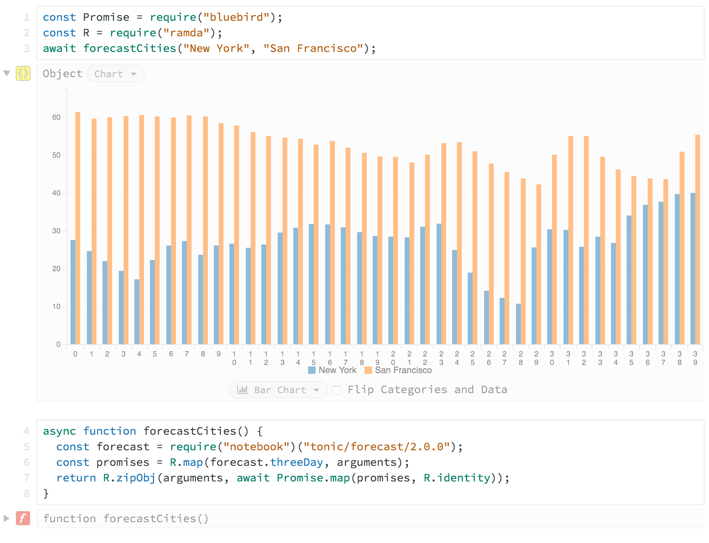

How do you try out node modules? Have you really thought about it at all? It's
something I've given some thought recently. Today's post presents three options
for trying out node modules with pros, cons, and recommended use cases for each.

## Option 1: Install to a temporary project.

This is probably the most common method. It has existed since [the dawn of
time][unix] and will probably persist until [the end of time][2038] because of
its simplicity. [Create and change to a new directory][mkcd], `npm i` some
stuff, and you're off! There are two primary avenues for trying things out with
this method: the `node` REPL and temporary scripts on disk executed via the
`node` CLI. Use the REPL when you're just trying out quick one-liners and use a
script when you need to repeat and iterate on something a little more complex.
What more needs to be said?

### Pros

* Simple. Nothing extra to install and it just works.
* Use alternate REPLs (Babel, CoffeeScript, etc).
* Flexibility in other ways to execute scripts (e.g., piping to `stdin`, passing
  JavaScript inline to [`-e`], or using [`-r`] one or more times).
* You are in complete control (node version, system tools, environment variables, etc).

### Cons

* Ceremony of multiple commands (`mkdir -p`, `cd`, `npm`, possibly other
  things).
* Sharing anything requires a little extra work (creating a Gist, repo, etc).
* You have to manually require modules if you want to access them by name.

## Option 2: ~~[Tonic]~~ [RunKit]

**Update 2016-09-15:** [Tonic] is now known as [RunKit].

You may have seen the following link in the sidebar on npm:

[][tonic-lodash]

That's a link to [Tonic], a service which gives you *notebooks* to play around
with node modules. These notebooks remind me a lot of Mathematica notebooks but
with JavaScript instead of crazy math stuff. You can essentially think of them
as node REPLs in your browser, with access to every version of every module on
npm. You also get a host of other cool features, like [data
visualization][tonic-data], [simple endpoint hosting][tonic-endpoint], and the
ability to share whatever you create. Additionally, [module authors can declare
examples for their modules directly in their `package.json`][tonic-example].

[][tonic-data]

Go ahead and click either screenshot above. They'll take you to some pre-defined
notebooks where you can play around. Better yet, I've embedded a notebook below
where you can try out Lodash:

<div id="tonic-lodash">
  // Require everything, or you can `require` individual functions
  // See https://knpw.rs/blog/using-lodash
  const _ = require('lodash');
  _.add(3, 5);
</div>

### Pros

* Nothing to install.
* Cool extra features (sharing, [data visualization][tonic-data],
  [endpoints][tonic-endpoint], etc, all built in). You can even [prototype Slack
  slash commands][tonic-slack].
* Use any version of node and use any version of any node modules from npm.

### Cons

* You have to wait on the server to evaluate your code. It isn't terribly slow,
  but there is a noticeable delay.
* No tab completion.

## Option 3: [repl'em]

[repl'em] is basically a node REPL which lets you pre-install and require
modules from its CLI. Want to try out [`moment`]? It's this easy:

```sh
replem moment
```

You are dropped in to a REPL with a variable named [`moment`] available to you.
Nice!

Want a REPL where [`Promise`] is actually [`bluebird`]? You can alias how
modules will be exposed:

```sh
replem bluebird:Promise
```

[repl'em] also lets you use `_` as an alias, which the default node REPL [does
not][node_]:

```sh
replem lodash:_
```

You can also install and use multiple modules all at once:

```sh
replem bluebird:Promise lodash:_ moment
```

And then you get some other stuff too, like using specific versions of modules,
exposing modules' properties, and custom REPLs (e.g., Babel, CoffeeScript, etc).
See [repl'em] for more details.

### Pros

* Automatic `camelCase` conversion of `kebab-case` package names.
* Tab completion works.
* Simple interface.
* Use alternate REPLs (Babel, CoffeeScript, etc).
* Retains history of past sessions.

### Cons

* Global package to install and keep updated.
* Cannot run scripts from disk (yet, as far as I can tell).

## So what should I use?

This is just what works best for me, you should experiment and find out what
works best for you. I've started using [repl'em] for my quick, one-off
experiments in favor of installing things to a local directory. If I need
something just a little more robust, however, like a quick script I'll be
iterating on, I'll favor the temporary project directory. If I intend to share
or embed something, I'll lean towards [Tonic].

## Did I miss anything?

Well, yeah, probably. Feel free to post in the comments down below or [reach out
to me on Twitter][twitter] to let me know your favorite way to try out node
modules.

<script async src="https://embed.tonicdev.com" data-element-id="tonic-lodash"></script>

[2038]: https://en.wikipedia.org/wiki/Year_2038_problem "Year 2038 Problem"
[mkcd]: https://github.com/knpwrs/dotfiles/blob/d37bcbd3abdbc490c7597d68ae88c047c92e16f2/lib/aliases.zsh#L30-L32 "mkcd"
[unix]: https://en.wikipedia.org/wiki/Unix_time "Unix Time"
[twitter]: https://twitter.com/knpwrs "@knpwrs"
[tonic]: https://tonicdev.com "Tonic"
[tonic-lodash]: https://tonicdev.com/npm/lodash "Try Lodash on Tonic"
[tonic-example]: https://tonicdev.uservoice.com/knowledgebase/articles/765846-how-do-i-customize-the-example-for-my-npm-package "How do I customize the example for my npm package?"
[tonic-endpoint]: https://tonicdev.com/docs/endpoint "Tonic Endpoint"
[tonic-data]: https://tonicdev.com/tonic/city-forecast "Tonic Data Visualization"
[tonic-slack]: https://tonicdev.com/matt/slack-slash-commands/1.0.0 "Tonic Slack Slash Commands"
[repl'em]: https://github.com/raine/replem "repl'em"
[RunKit]: http://blog.runkit.com/2016/09/13/tonic-is-now-runkit-a-part-of-stripe.html "RunKit"
[node_]: https://nodejs.org/api/repl.html#repl_repl_features "Node REPL Features"
[`-e`]: https://nodejs.org/api/cli.html#cli_e_eval_script "Evaluate argument as JavaScript."
[`-r`]: https://nodejs.org/api/cli.html#cli_r_require_module "Require argument as module."
[`moment`]: http://momentjs.com/ "Moment.js: Parse, validate, manipulate, and display dates in JavaScript."
[`Promise`]: https://developer.mozilla.org/en-US/docs/Web/JavaScript/Reference/Global_Objects/Promise "MDN: Promise"
[`bluebird`]: http://bluebirdjs.com/docs/getting-started.html "A full-featured promises library with unmatched performance."
